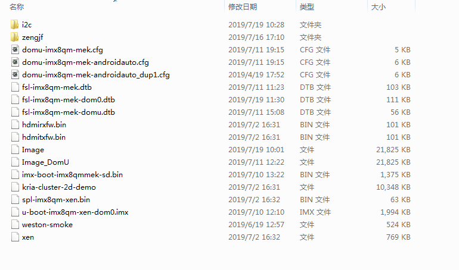

# boot.img

## 参考文档

* [0009_YOCTO_SD_Image_Generate.md](docs/0009_YOCTO_SD_Image_Generate.md)

## boot partition



## mcopy

* where is mcopy
  ```
  zengjf@UbuntuServer:imx8-build-wayland$ find * -iname mcopy
  tmp/work/x86_64-linux/mtools-native/4.0.18-r0/image/home/zengjf/imx8-yocto-ga/imx8-build-wayland/tmp/work/x86_64-linux/mtools-native/4.0.18-r0/recipe-sysroot-native/usr/bin/mcopy
  tmp/work/x86_64-linux/mtools-native/4.0.18-r0/build/mcopy
  tmp/work/x86_64-linux/mtools-native/4.0.18-r0/sysroot-destdir/home/zengjf/imx8-yocto-ga/imx8-build-wayland/tmp/work/x86_64-linux/mtools-native/4.0.18-r0/recipe-sysroot-native/usr/bin/mcopy
  ^C
  ```
* mcopy help
  ```
  Mtools version 4.0.18, dated January 9th, 2013
  Usage: ./mcopy [-spatnmQVBT] [-D clash_option] sourcefile targetfile
         ./mcopy [-spatnmQVBT] [-D clash_option] sourcefile [sourcefiles...] targetdirectory
  ```
* `mcopy -i` code: https://github.com/Distrotech/mtools/blob/master/mcopy.c#L533
  * `void set_cmd_line_image(char *img, int flags);`

## recipes依赖关系

* `bitbake linux-imx -c deploy -DD -f`
  ```
  [...省略]
  DEBUG: Parsing /home/zengjf/imx8-yocto-ga/sources/meta-fsl-bsp-release/imx/meta-bsp/recipes-kernel/linux/linux-imx_4.14.78.bb (full)
  DEBUG: CONF /home/zengjf/imx8-yocto-ga/sources/meta-fsl-bsp-release/imx/meta-bsp/recipes-kernel/linux/linux-imx_4.14.78.bb:5: including recipes-kernel/linux/linux-imx.inc
  DEBUG: Inheriting /home/zengjf/imx8-yocto-ga/sources/poky/meta/classes/kernel.bbclass (from /home/zengjf/imx8-yocto-ga/sources/meta-freescale/recipes-kernel/linux/linux-imx.inc:7)
  DEBUG: Inheriting /home/zengjf/imx8-yocto-ga/sources/poky/meta/classes/linux-kernel-base.bbclass (from /home/zengjf/imx8-yocto-ga/sources/poky/meta/classes/kernel.bbclass:1)
  DEBUG: Inheriting /home/zengjf/imx8-yocto-ga/sources/poky/meta/classes/kernel-module-split.bbclass (from /home/zengjf/imx8-yocto-ga/sources/poky/meta/classes/kernel.bbclass:1)
  DEBUG: Inheriting /home/zengjf/imx8-yocto-ga/sources/poky/meta/classes/kernel-uimage.bbclass (from /home/zengjf/imx8-yocto-ga/sources/poky/meta/classes/kernel.bbclass:120)
  DEBUG: Inheriting /home/zengjf/imx8-yocto-ga/sources/poky/meta/classes/kernel-uboot.bbclass (from /home/zengjf/imx8-yocto-ga/sources/poky/meta/classes/kernel-uimage.bbclass:1)
  DEBUG: Inheriting /home/zengjf/imx8-yocto-ga/sources/poky/meta/classes/kernel-arch.bbclass (from /home/zengjf/imx8-yocto-ga/sources/poky/meta/classes/kernel.bbclass:146)
  DEBUG: Inheriting /home/zengjf/imx8-yocto-ga/sources/poky/meta/classes/deploy.bbclass (from /home/zengjf/imx8-yocto-ga/sources/poky/meta/classes/kernel.bbclass:146)
  DEBUG: Inheriting /home/zengjf/imx8-yocto-ga/sources/poky/meta/classes/cml1.bbclass (from /home/zengjf/imx8-yocto-ga/sources/poky/meta/classes/kernel.bbclass:535)
  DEBUG: Inheriting /home/zengjf/imx8-yocto-ga/sources/poky/meta/classes/kernel-devicetree.bbclass (from /home/zengjf/imx8-yocto-ga/sources/poky/meta/classes/kernel.bbclass:713)
  DEBUG: Inheriting /home/zengjf/imx8-yocto-ga/sources/meta-freescale/classes/fsl-kernel-localversion.bbclass (from /home/zengjf/imx8-yocto-ga/sources/meta-freescale/recipes-kernel/linux/linux-imx.inc:7)
  DEBUG: Inheriting /home/zengjf/imx8-yocto-ga/sources/meta-freescale/classes/fsl-vivante-kernel-driver-handler.bbclass (from /home/zengjf/imx8-yocto-ga/sources/meta-freescale/recipes-kernel/linux/linux-imx.inc:7)
  DEBUG: CONF /home/zengjf/imx8-yocto-ga/sources/meta-fsl-bsp-release/imx/meta-bsp/recipes-kernel/linux/linux-imx_4.14.78.bb:6: including recipes-kernel/linux/linux-imx-src-4.14.78.inc
  DEBUG: Use 'imx8qmmek' as package architecture for 'linux-imx'
  [...省略]
  ```

## 代码分析

* `meta-fsl-bsp-release/imx/meta-bsp/classes/image_types_fsl.bbclass`
  ```
  _generate_boot_image() {
          local boot_part=$1
  
          # Create boot partition image
          BOOT_BLOCKS=$(LC_ALL=C parted -s ${SDCARD} unit b print \
                            | awk "/ $boot_part / { print substr(\$4, 1, length(\$4 -1)) / 1024 }")
  
          # mkdosfs will sometimes use FAT16 when it is not appropriate,
          # resulting in a boot failure from SYSLINUX. Use FAT32 for
          # images larger than 512MB, otherwise let mkdosfs decide.
          if [ $(expr $BOOT_BLOCKS / 1024) -gt 512 ]; then
                  FATSIZE="-F 32"
          fi
  
          rm -f ${WORKDIR}/boot.img
          mkfs.vfat -n "${BOOTDD_VOLUME_ID}" -S 512 ${FATSIZE} -C ${WORKDIR}/boot.img $BOOT_BLOCKS
  
          mcopy -i ${WORKDIR}/boot.img -s ${DEPLOY_DIR_IMAGE}/${KERNEL_IMAGETYPE}-${MACHINE}.bin ::/${KERNEL_IMAGETYPE}
  
          # Copy boot scripts
          for item in ${BOOT_SCRIPTS}; do
                  src=`echo $item | awk -F':' '{ print $1 }'`
                  dst=`echo $item | awk -F':' '{ print $2 }'`
  
                  mcopy -i ${WORKDIR}/boot.img -s ${DEPLOY_DIR_IMAGE}/$src ::/$dst
          done
  
          # Copy device tree file
          if test -n "${KERNEL_DEVICETREE}"; then
                  for DTS_FILE in ${KERNEL_DEVICETREE}; do
                          DTS_BASE_NAME=`basename ${DTS_FILE} | awk -F "." '{print $1}'`
                          if [ -e "${DEPLOY_DIR_IMAGE}/${KERNEL_IMAGETYPE}-${DTS_BASE_NAME}.dtb" ]; then
                                  kernel_bin="`readlink ${DEPLOY_DIR_IMAGE}/${KERNEL_IMAGETYPE}-${MACHINE}.bin`"
                                  kernel_bin_for_dtb="`readlink ${DEPLOY_DIR_IMAGE}/${KERNEL_IMAGETYPE}-${DTS_BASE_NAME}.dtb | sed "s,$DTS_BASE_NAME,${MACHINE},g;s,\.dtb$,.bin,g"`"
                                  if [ $kernel_bin = $kernel_bin_for_dtb ]; then
                                          mcopy -i ${WORKDIR}/boot.img -s ${DEPLOY_DIR_IMAGE}/${KERNEL_IMAGETYPE}-${DTS_BASE_NAME}.dtb ::/${DTS_BASE_NAME}.dtb
                                  fi
                          else
                                  bbfatal "${DTS_FILE} does not exist."
                          fi
                  done
          fi
  
          # Copy extlinux.conf to images that have U-Boot Extlinux support.
          if [ "${UBOOT_EXTLINUX}" = "1" ]; then
                  mmd -i ${WORKDIR}/boot.img ::/extlinux
                  mcopy -i ${WORKDIR}/boot.img -s ${DEPLOY_DIR_IMAGE}/extlinux.conf ::/extlinux/extlinux.conf
          fi
  
          # Copy additional files to boot partition: such as m4 images and firmwares
          if [ -n "${IMAGE_BOOTFILES}" ]; then
              for IMAGE_FILE in ${IMAGE_BOOTFILES}; do
                  if [ -e "${DEPLOY_DIR_IMAGE}/${IMAGE_FILE}" ]; then
                      mcopy -i ${WORKDIR}/boot.img -s ${DEPLOY_DIR_IMAGE}/${IMAGE_FILE} ::/${IMAGE_FILE}
                  else
                      bbfatal "${IMAGE_FILE} does not exist."
                  fi
              done
          fi
  
      # add tee to boot image
      if ${@bb.utils.contains('COMBINED_FEATURES', 'optee', 'true', 'false', d)}; then
          for UTEE_FILE_PATH in `find ${DEPLOY_DIR_IMAGE} -maxdepth 1 -type f -name 'uTee-*' -print -quit`; do
              UTEE_FILE=`basename ${UTEE_FILE_PATH}`
              mcopy -i ${WORKDIR}/boot.img -s ${DEPLOY_DIR_IMAGE}/${UTEE_FILE} ::/${UTEE_FILE}
          done
      fi
  
  }
  ```
* run time code: `tmp/work/imx8qmmek-poky-linux/fsl-image-qt5-validation-imx/1.0-r0/temp/run.do_image_sdcard`
  ```
  _generate_boot_image() {
          local boot_part=$1
  
          # Create boot partition image
          BOOT_BLOCKS=$(LC_ALL=C parted -s /home/zengjf/imx8-yocto-ga/imx8-build-wayland/tmp/work/imx8qmmek-poky-linux/fsl-image-qt5-validation-imx/1.0-r0/deploy-fsl-image-qt5-validation-imx-image-complete/fsl-image-qt5-validation-imx-imx8qmmek-20190725051445.rootfs.sdcard unit b print \
                            | awk "/ $boot_part / { print substr(\$4, 1, length(\$4 -1)) / 1024 }")
  
          # mkdosfs will sometimes use FAT16 when it is not appropriate,
          # resulting in a boot failure from SYSLINUX. Use FAT32 for
          # images larger than 512MB, otherwise let mkdosfs decide.
          if [ $(expr $BOOT_BLOCKS / 1024) -gt 512 ]; then
                  FATSIZE="-F 32"
          fi
  
          rm -f /home/zengjf/imx8-yocto-ga/imx8-build-wayland/tmp/work/imx8qmmek-poky-linux/fsl-image-qt5-validation-imx/1.0-r0/boot.img
          mkfs.vfat -n "Boot imx8qmmek" -S 512 ${FATSIZE} -C /home/zengjf/imx8-yocto-ga/imx8-build-wayland/tmp/work/imx8qmmek-poky-linux/fsl-image-qt5-validation-imx/1.0-r0/boot.img $BOOT_BLOCKS
  
          mcopy -i /home/zengjf/imx8-yocto-ga/imx8-build-wayland/tmp/work/imx8qmmek-poky-linux/fsl-image-qt5-validation-imx/1.0-r0/boot.img -s /home/zengjf/imx8-yocto-ga/imx8-build-wayland/tmp/deploy/images/imx8qmmek/Image-imx8qmmek.bin ::/Image
  
          # Copy boot scripts
          for item in ${BOOT_SCRIPTS}; do
                  src=`echo $item | awk -F':' '{ print $1 }'`
                  dst=`echo $item | awk -F':' '{ print $2 }'`
  
                  mcopy -i /home/zengjf/imx8-yocto-ga/imx8-build-wayland/tmp/work/imx8qmmek-poky-linux/fsl-image-qt5-validation-imx/1.0-r0/boot.img -s /home/zengjf/imx8-yocto-ga/imx8-build-wayland/tmp/deploy/images/imx8qmmek/$src ::/$dst
          done
  
          # Copy device tree file
          if test -n "freescale/fsl-imx8qm-mek.dtb freescale/fsl-imx8qm-mek_ca53.dtb freescale/fsl-imx8qm-mek_ca72.dtb  freescale/fsl-imx8qm-mek-8cam.dtb  freescale/fsl-imx8qm-mek-hdmi.dtb  freescale/fsl-imx8qm-mek-jdi-wuxga-lvds1-panel.dtb freescale/fsl-imx8qm-mek-dsi-rm67191.dtb freescale/fsl-imx8qm-mek-mipi-ov5640.dtb freescale/fsl-imx8qm-mek-mipi-two-ov5640.dtb freescale/fsl-imx8qm-mek-enet2-tja1100.dtb freescale/fsl-imx8qm-mek-inmate.dtb freescale/fsl-imx8qm-mek-dom0.dtb freescale/fsl-imx8qm-mek-domu.dtb freescale/fsl-imx8qm-mek-domu-car.dtb freescale/fsl-imx8qm-mek-domu-dpu1.dtb freescale/fsl-imx8qm-mek-dom0-dpu2.dtb freescale/fsl-imx8qm-mek-domu-dpu1-hdmi.dtb freescale/fsl-imx8qm-mek-root.dtb freescale/fsl-imx8qm-mek-hdmi-in.dtb freescale/fsl-imx8qm-mek-m4.dtb"; then
                  for DTS_FILE in freescale/fsl-imx8qm-mek.dtb freescale/fsl-imx8qm-mek_ca53.dtb freescale/fsl-imx8qm-mek_ca72.dtb  freescale/fsl-imx8qm-mek-8cam.dtb  freescale/fsl-imx8qm-mek-hdmi.dtb  freescale/fsl-imx8qm-mek-jdi-wuxga-lvds1-panel.dtb freescale/fsl-imx8qm-mek-dsi-rm67191.dtb freescale/fsl-imx8qm-mek-mipi-ov5640.dtb freescale/fsl-imx8qm-mek-mipi-two-ov5640.dtb freescale/fsl-imx8qm-mek-enet2-tja1100.dtb freescale/fsl-imx8qm-mek-inmate.dtb freescale/fsl-imx8qm-mek-dom0.dtb freescale/fsl-imx8qm-mek-domu.dtb freescale/fsl-imx8qm-mek-domu-car.dtb freescale/fsl-imx8qm-mek-domu-dpu1.dtb freescale/fsl-imx8qm-mek-dom0-dpu2.dtb freescale/fsl-imx8qm-mek-domu-dpu1-hdmi.dtb freescale/fsl-imx8qm-mek-root.dtb freescale/fsl-imx8qm-mek-hdmi-in.dtb freescale/fsl-imx8qm-mek-m4.dtb; do
                          DTS_BASE_NAME=`basename ${DTS_FILE} | awk -F "." '{print $1}'`
                          if [ -e "/home/zengjf/imx8-yocto-ga/imx8-build-wayland/tmp/deploy/images/imx8qmmek/Image-${DTS_BASE_NAME}.dtb" ]; then
                                  kernel_bin="`readlink /home/zengjf/imx8-yocto-ga/imx8-build-wayland/tmp/deploy/images/imx8qmmek/Image-imx8qmmek.bin`"
                                  kernel_bin_for_dtb="`readlink /home/zengjf/imx8-yocto-ga/imx8-build-wayland/tmp/deploy/images/imx8qmmek/Image-${DTS_BASE_NAME}.dtb | sed "s,$DTS_BASE_NAME,imx8qmmek,g;s,\.dtb$,.bin,g"`"
                                  if [ $kernel_bin = $kernel_bin_for_dtb ]; then
                                          mcopy -i /home/zengjf/imx8-yocto-ga/imx8-build-wayland/tmp/work/imx8qmmek-poky-linux/fsl-image-qt5-validation-imx/1.0-r0/boot.img -s /home/zengjf/imx8-yocto-ga/imx8-build-wayland/tmp/deploy/images/imx8qmmek/Image-${DTS_BASE_NAME}.dtb ::/${DTS_BASE_NAME}.dtb
                                  fi
                          else
                                  bbfatal "${DTS_FILE} does not exist."
                          fi
                  done
          fi
  
          # Copy extlinux.conf to images that have U-Boot Extlinux support.
          if [ "${UBOOT_EXTLINUX}" = "1" ]; then
                  mmd -i /home/zengjf/imx8-yocto-ga/imx8-build-wayland/tmp/work/imx8qmmek-poky-linux/fsl-image-qt5-validation-imx/1.0-r0/boot.img ::/extlinux
                  mcopy -i /home/zengjf/imx8-yocto-ga/imx8-build-wayland/tmp/work/imx8qmmek-poky-linux/fsl-image-qt5-validation-imx/1.0-r0/boot.img -s /home/zengjf/imx8-yocto-ga/imx8-build-wayland/tmp/deploy/images/imx8qmmek/extlinux.conf ::/extlinux/extlinux.conf
          fi
  
          # Copy additional files to boot partition: such as m4 images and firmwares
          if [ -n " hdmitxfw.bin hdmirxfw.bin dpfw.bin xen" ]; then
              for IMAGE_FILE in  hdmitxfw.bin hdmirxfw.bin dpfw.bin xen; do
                  if [ -e "/home/zengjf/imx8-yocto-ga/imx8-build-wayland/tmp/deploy/images/imx8qmmek/${IMAGE_FILE}" ]; then
                      mcopy -i /home/zengjf/imx8-yocto-ga/imx8-build-wayland/tmp/work/imx8qmmek-poky-linux/fsl-image-qt5-validation-imx/1.0-r0/boot.img -s /home/zengjf/imx8-yocto-ga/imx8-build-wayland/tmp/deploy/images/imx8qmmek/${IMAGE_FILE} ::/${IMAGE_FILE}
                  else
                      bbfatal "${IMAGE_FILE} does not exist."
                  fi
              done
          fi
  
      # add tee to boot image
      if false; then
          for UTEE_FILE_PATH in `find /home/zengjf/imx8-yocto-ga/imx8-build-wayland/tmp/deploy/images/imx8qmmek -maxdepth 1 -type f -name 'uTee-*' -print -quit`; do
              UTEE_FILE=`basename ${UTEE_FILE_PATH}`
              mcopy -i /home/zengjf/imx8-yocto-ga/imx8-build-wayland/tmp/work/imx8qmmek-poky-linux/fsl-image-qt5-validation-imx/1.0-r0/boot.img -s /home/zengjf/imx8-yocto-ga/imx8-build-wayland/tmp/deploy/images/imx8qmmek/${UTEE_FILE} ::/${UTEE_FILE}
          done
      fi
  }
  ```

## Kernel 编译代码分析

* `bitbake fsl-image-qt5-validation-imx -g`
* `cat recipe-depends.dot | grep linux | grep kernel`
  ```
  "cryptodev-linux" [label="cryptodev-linux\n:1.9-r0\n/home/zengjf/imx8-yocto-ga/sources/poky/meta/recipes-kernel/cryptodev/cryptodev-linux_1.9.bb"]
  "kernel-module-imx-gpu-viv" -> "linux-imx"
  "kernel-module-imx-gpu-viv" -> "linux-libc-headers"
  "kernel-module-qca6174" -> "linux-imx"
  "kernel-module-qca6174" -> "linux-libc-headers"
  "linux-imx" [label="linux-imx\n:4.14.78-r0\n/home/zengjf/imx8-yocto-ga/sources/meta-fsl-bsp-release/imx/meta-bsp/recipes-kernel/linux/linux-imx_4.14.78.bb"]
  "linux-libc-headers" [label="linux-libc-headers\n:4.14-r0\n/home/zengjf/imx8-yocto-ga/sources/meta-fsl-bsp-release/imx/meta-bsp/recipes-kernel/linux-libc-headers/linux-libc-headers_4.14.bb"]
  ```
* `meta-fsl-bsp-release/imx/meta-bsp/recipes-kernel/linux/linux-imx_4.14.78.bb`
  ```
  # Copyright (C) 2013-2016 Freescale Semiconductor
  # Copyright 2017-2018 NXP
  # Released under the MIT license (see COPYING.MIT for the terms)
  
  require recipes-kernel/linux/linux-imx.inc
  require recipes-kernel/linux/linux-imx-src-${PV}.inc
  
  SUMMARY = "Linux Kernel provided and supported by NXP"
  DESCRIPTION = "Linux Kernel provided and supported by NXP with focus on \
  i.MX Family Reference Boards. It includes support for many IPs such as GPU, VPU and IPU."
  
  DEPENDS += "lzop-native bc-native"
  [...省略]
  ```
* meta-freescale/recipes-kernel/linux/linux-imx.inc
  ```
  # Copyright (C) 2012, 2015 O.S. Systems Software LTDA.
  # Released under the MIT license (see COPYING.MIT for the terms)

  LICENSE = "GPLv2"
  LIC_FILES_CHKSUM = "file://COPYING;md5=d7810fab7487fb0aad327b76f1be7cd7"

  inherit kernel fsl-kernel-localversion fsl-vivante-kernel-driver-handler

  # Put a local version until we have a true SRCREV to point to
  LOCALVERSION ?= ""
  SCMVERSION ?= "y"
  SRCBRANCH ?= ""

  [...省略]
  ```
* `poky/meta/classes/kernel.bbclass`
  ```
  [...省略]
  do_deploy[cleandirs] = "${DEPLOYDIR}"
  do_deploy[dirs] = "${DEPLOYDIR} ${B}"
  do_deploy[prefuncs] += "package_get_auto_pr"
  
  addtask deploy after do_populate_sysroot do_packagedata
  
  EXPORT_FUNCTIONS do_deploy
  
  # Add using Device Tree support
  inherit kernel-devicetree
  ```
* `poky/meta/classes/kernel-devicetree.bbclass`
  ```
  do_deploy_append() {
          for DTB in ${KERNEL_DEVICETREE}; do
                  DTB=`normalize_dtb "${DTB}"`
                  DTB_EXT=${DTB##*.}
                  DTB_BASE_NAME=`basename ${DTB} ."${DTB_EXT}"`
                  for type in ${KERNEL_IMAGETYPE_FOR_MAKE}; do
                          base_name=${type}"-"${KERNEL_IMAGE_BASE_NAME}
                          symlink_name=${type}"-"${KERNEL_IMAGE_SYMLINK_NAME}
                          DTB_NAME=`echo ${base_name} | sed "s/${MACHINE}/${DTB_BASE_NAME}/g"`
                          DTB_SYMLINK_NAME=`echo ${symlink_name} | sed "s/${MACHINE}/${DTB_BASE_NAME}/g"`
                          DTB_PATH=`get_real_dtb_path_in_kernel "${DTB}"`
                          install -d ${DEPLOYDIR}
                          install -m 0644 ${DTB_PATH} ${DEPLOYDIR}/${DTB_NAME}.${DTB_EXT}
                          ln -sf ${DTB_NAME}.${DTB_EXT} ${DEPLOYDIR}/${DTB_SYMLINK_NAME}.${DTB_EXT}
                          ln -sf ${DTB_NAME}.${DTB_EXT} ${DEPLOYDIR}/${DTB_BASE_NAME}.${DTB_EXT}
  
                          if [ "$type" = "zImage" ] && [ "${KERNEL_DEVICETREE_BUNDLE}" = "1" ]; then
                                  cat ${DEPLOYDIR}/$type \
                                          ${DEPLOYDIR}/${DTB_NAME}.${DTB_EXT} \
                                          > ${DEPLOYDIR}/${DTB_NAME}.${DTB_EXT}.bin
                                  ln -sf ${DTB_NAME}.${DTB_EXT}.bin ${DEPLOYDIR}/$type-${DTB_BASE_NAME}.${DTB_EXT}.bin
  
                                  if [ -e "${KERNEL_OUTPUT_DIR}/${type}.initramfs" ]; then
                                          cat ${KERNEL_OUTPUT_DIR}/${type}.initramfs \
                                                  ${DEPLOYDIR}/${DTB_NAME}.${DTB_EXT} \
                                                  > ${DEPLOYDIR}/${type}-${INITRAMFS_BASE_NAME}-${DTB_BASE_NAME}.${DTB_EXT}.bin
                                          ln -sf ${type}-${INITRAMFS_BASE_NAME}-${DTB_BASE_NAME}.${DTB_EXT}.bin \
                                                 ${DEPLOYDIR}/${type}-initramfs-${DTB_BASE_NAME}.${DTB_EXT}-${MACHINE}.bin
                                  fi
                          fi
                  done
          done
  }
  ```
* `ls -al tmp/work/imx8qmmek-poky-linux/linux-imx/4.14.78-r0` 
  ```
  total 640
  drwxrwxr-x  15 zengjf zengjf   4096 Mar  5 15:32 .
  drwxrwxr-x   3 zengjf zengjf   4096 Jan  3  2019 ..
  -rw-rw-r--   1 zengjf zengjf    619 Jan  3  2019 0001-uapi-Add-ion.h-to-userspace.patch
  drwxr-xr-x  22 zengjf zengjf   4096 Jan 23  2019 build
  -rw-r--r--   1 zengjf zengjf  19223 Jan  3  2019 defconfig
  drwxr-xr-x   2 zengjf zengjf   4096 Jan 23  2019 deploy-linux-imx
  drwxr-xr-x   3 zengjf zengjf   4096 Jan 23  2019 deploy-rpms
  lrwxrwxrwx   1 zengjf zengjf     83 Jan  3  2019 git -> /home/zengjf/imx8-yocto-ga/imx8-build-wayland/tmp/work-shared/imx8qmmek/kernel-source
  drwxr-xr-x   5 zengjf zengjf   4096 Jan 23  2019 image
  drwxrwxr-x   3 zengjf zengjf   4096 Jan  5  2019 license-destdir
  -rw-r--r--   1 zengjf zengjf 519018 Jan 23  2019 linux-imx.spec
  drwxr-xr-x   4 zengjf zengjf   4096 Jan 23  2019 package
  drwxr-xr-x 304 zengjf zengjf  28672 Jan 23  2019 packages-split
  drwxr-xr-x   7 zengjf zengjf   4096 Jan 23  2019 pkgdata
  drwxrwxr-x   2 zengjf zengjf   4096 Jan 23  2019 pseudo
  drwxrwxr-x   5 zengjf zengjf   4096 Jan 23  2019 recipe-sysroot
  drwxrwxr-x  10 zengjf zengjf   4096 Jan  4  2019 recipe-sysroot-native
  drwxr-xr-x   3 zengjf zengjf   4096 Jan 23  2019 sysroot-destdir
  drwxrwxr-x   2 zengjf zengjf  20480 Jul 26 12:10 temp
  ```
* `tmp/work/imx8qmmek-poky-linux/linux-imx/4.14.78-r0/temp/run.do_deploy`
  ```
  [...省略]
  do_deploy() {                                # 暂时没找到这个是怎么包含下面的代码的
      kernel_do_deploy
          for DTB in freescale/fsl-imx8qm-mek.dtb freescale/fsl-imx8qm-mek_ca53.dtb freescale/fsl-imx8qm-mek_ca72.dtb  freescale/fsl-imx8qm-mek-8cam.dtb  freescale/fsl-imx8qm-mek-hdmi.dtb  freescale/fsl-imx8qm-mek-jdi-wuxga-lvds1-panel.dtb freescale/fsl-imx8qm-mek-dsi-rm67191.dtb freescale/fsl-imx8qm-mek-mipi-ov5640.dtb freescale/fsl-imx8qm-mek-mipi-two-ov5640.dtb freescale/fsl-imx8qm-mek-enet2-tja1100.dtb freescale/fsl-imx8qm-mek-inmate.dtb freescale/fsl-imx8qm-mek-dom0.dtb freescale/fsl-imx8qm-mek-domu.dtb freescale/fsl-imx8qm-mek-domu-car.dtb freescale/fsl-imx8qm-mek-domu-dpu1.dtb freescale/fsl-imx8qm-mek-dom0-dpu2.dtb freescale/fsl-imx8qm-mek-domu-dpu1-hdmi.dtb freescale/fsl-imx8qm-mek-root.dtb freescale/fsl-imx8qm-mek-hdmi-in.dtb freescale/fsl-imx8qm-mek-m4.dtb; do
                  DTB=`normalize_dtb "${DTB}"`
                  DTB_EXT=${DTB##*.}
                  DTB_BASE_NAME=`basename ${DTB} ."${DTB_EXT}"`
                  for type in Image; do
                          base_name=${type}"-"-4.14.78-r0-imx8qmmek-20190123120805
                          symlink_name=${type}"-"imx8qmmek
                          DTB_NAME=`echo ${base_name} | sed "s/imx8qmmek/${DTB_BASE_NAME}/g"`
                          DTB_SYMLINK_NAME=`echo ${symlink_name} | sed "s/imx8qmmek/${DTB_BASE_NAME}/g"`
                          DTB_PATH=`get_real_dtb_path_in_kernel "${DTB}"`
                          install -d /home/zengjf/imx8-yocto-ga/imx8-build-wayland/tmp/work/imx8qmmek-poky-linux/linux-imx/4.14.78-r0/deploy-linux-imx
                          install -m 0644 ${DTB_PATH} /home/zengjf/imx8-yocto-ga/imx8-build-wayland/tmp/work/imx8qmmek-poky-linux/linux-imx/4.14.78-r0/deploy-linux-imx/${DTB_NAME}.${DTB_EXT}
                          ln -sf ${DTB_NAME}.${DTB_EXT} /home/zengjf/imx8-yocto-ga/imx8-build-wayland/tmp/work/imx8qmmek-poky-linux/linux-imx/4.14.78-r0/deploy-linux-imx/${DTB_SYMLINK_NAME}.${DTB_EXT}
                          ln -sf ${DTB_NAME}.${DTB_EXT} /home/zengjf/imx8-yocto-ga/imx8-build-wayland/tmp/work/imx8qmmek-poky-linux/linux-imx/4.14.78-r0/deploy-linux-imx/${DTB_BASE_NAME}.${DTB_EXT}
  
                          if [ "$type" = "zImage" ] && [ "0" = "1" ]; then
                                  cat /home/zengjf/imx8-yocto-ga/imx8-build-wayland/tmp/work/imx8qmmek-poky-linux/linux-imx/4.14.78-r0/deploy-linux-imx/$type \
                                          /home/zengjf/imx8-yocto-ga/imx8-build-wayland/tmp/work/imx8qmmek-poky-linux/linux-imx/4.14.78-r0/deploy-linux-imx/${DTB_NAME}.${DTB_EXT} \
                                          > /home/zengjf/imx8-yocto-ga/imx8-build-wayland/tmp/work/imx8qmmek-poky-linux/linux-imx/4.14.78-r0/deploy-linux-imx/${DTB_NAME}.${DTB_EXT}.bin
                                  ln -sf ${DTB_NAME}.${DTB_EXT}.bin /home/zengjf/imx8-yocto-ga/imx8-build-wayland/tmp/work/imx8qmmek-poky-linux/linux-imx/4.14.78-r0/deploy-linux-imx/$type-${DTB_BASE_NAME}.${DTB_EXT}.bin
  
                                  if [ -e "arch/arm64/boot/${type}.initramfs" ]; then
                                          cat arch/arm64/boot/${type}.initramfs \
                                                  /home/zengjf/imx8-yocto-ga/imx8-build-wayland/tmp/work/imx8qmmek-poky-linux/linux-imx/4.14.78-r0/deploy-linux-imx/${DTB_NAME}.${DTB_EXT} \
                                                  > /home/zengjf/imx8-yocto-ga/imx8-build-wayland/tmp/work/imx8qmmek-poky-linux/linux-imx/4.14.78-r0/deploy-linux-imx/${type}-initramfs-4.14.78-r0-imx8qmmek-20190123120805-${DTB_BASE_NAME}.${DTB_EXT}.bin
                                          ln -sf ${type}-initramfs-4.14.78-r0-imx8qmmek-20190123120805-${DTB_BASE_NAME}.${DTB_EXT}.bin \
                                                 /home/zengjf/imx8-yocto-ga/imx8-build-wayland/tmp/work/imx8qmmek-poky-linux/linux-imx/4.14.78-r0/deploy-linux-imx/${type}-initramfs-${DTB_BASE_NAME}.${DTB_EXT}-imx8qmmek.bin
                                  fi
                          fi
                  done
          done
  }

  kernel_do_deploy() {
          deployDir="/home/zengjf/imx8-yocto-ga/imx8-build-wayland/tmp/work/imx8qmmek-poky-linux/linux-imx/4.14.78-r0/deploy-linux-imx"
          if [ -n "" ]; then
                  deployDir="/home/zengjf/imx8-yocto-ga/imx8-build-wayland/tmp/work/imx8qmmek-poky-linux/linux-imx/4.14.78-r0/deploy-linux-imx/"
                  mkdir "$deployDir"

          for type in Image ; do
                  base_name=${type}--4.14.78-r0-imx8qmmek-20190726055721
                  install -m 0644 arch/arm64/boot/${type} $deployDir/${base_name}.bin                   // Image转换成带格式的文件
          done
          if [ 1 = "1" ] && (grep -q -i -e '^CONFIG_MODULES=y$' .config); then
                  mkdir -p /home/zengjf/imx8-yocto-ga/imx8-build-wayland/tmp/work/imx8qmmek-poky-linux/linux-imx/4.14.78-r0/image/lib
                  tar -cvzf $deployDir/modules--4.14.78-r0-imx8qmmek-20190726055721.tgz -C /home/zengjf/imx8-yocto-ga/imx8-build-wayland/tmp/work/imx8qmmek-poky-linux/linux-imx/4.14.78-r0/image lib
                  ln -sf modules--4.14.78-r0-imx8qmmek-20190726055721.tgz $deployDir/modules-imx8qmmek.tgz

          for type in Image ; do
                  base_name=${type}--4.14.78-r0-imx8qmmek-20190726055721
                  symlink_name=${type}-imx8qmmek
                  ln -sf ${base_name}.bin $deployDir/${symlink_name}.bin                                // 目标链接生成
                  ln -sf ${base_name}.bin $deployDir/${type}
          do
           cd /home/zengjf/imx8-yocto-ga/imx8-build-wayland/tmp/work/imx8qmmek-poky-linux/linux-imx/4.14.78-r0/build
           # Update deploy directory
           for type in Image ; do
                   if [ -e "arch/arm64/boot/${type}.initramfs" ]; then
                           echo "Copying deploy ${type} kernel-initramfs image and setting up links..."
                           initramfs_base_name=${type}-initramfs-4.14.78-r0-imx8qmmek-20190726055721
                           initramfs_symlink_name=${type}-initramfs-imx8qmmek
                           install -m 0644 arch/arm64/boot/${type}.initramfs $deployDir/${initramfs_base_name}.bin
                           ln -sf ${initramfs_base_name}.bin $deployDir/${initramfs_symlink_name}.bin
                   fi
           done
  }
  ```
* `ls -al tmp/deploy/images/imx8qmmek/Image-imx8qmmek.bin`
  ```
  lrwxrwxrwx  2 zengjf zengjf       46 Jul 26 13:57 Image-imx8qmmek.bin -> Image--4.14.78-r0-imx8qmmek-20190726055721.bin
  ```
* `Image--4.14.78-r0-imx8qmmek-20190726055721.bin` --> `arch/arm64/boot/Image`
