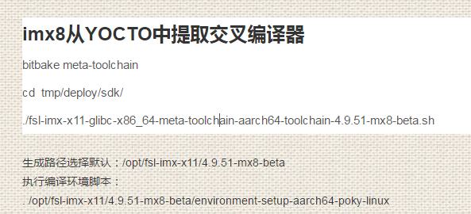

# digital cluster

## yocto编译器信息提取



## compile

* path: `imx-yocto-bsp/digital_cluster/digital_cluster`
* `source /opt/fsl-imx-x11/4.9.51-mx8-beta/environment-setup-aarch64-poky-linux`
* `make -j20`

## vgapp service source code

* 如果`/etc/systemd/system`下`local-fs-pre.target.wants`不存在就创建一个；
* vgapp.service
  ```
  root@imx8qmmek:/etc/systemd/system# ls -al local-fs-pre.target.wants/vgapp.servic
  lrwxrwxrwx 1 root root 33 Jun 28 09:02 local-fs-pre.target.wants/vgapp.service -> /lib/systemd/system/vgapp.service
  ```
* source code
  ```
  root@imx8qmmek:/etc/systemd/system# cat /lib/systemd/system/vgapp.service
  [Unit]
  Description=vgapp
  
  [Service]
  User=root
  ExecStart=/bin/vgapp
  
  [Install]
  WantedBy=basic.target
  ```

## systemd service时间测试

* basic.target.wants/vgapp.service: 1.4s
  * (190703_17:01:50.648)
  * (190703_17:01:52.227)
* local-fs.target.wants/vgapp.service: 1.1s
  * (190703_17:21:35.608)
  * (190703_17:21:46.726)
* local-fs-pre.target.wants/vgapp.service: 0.581s
  * (190703_17:44:25.722)
  * (190703_17:44:26.303)